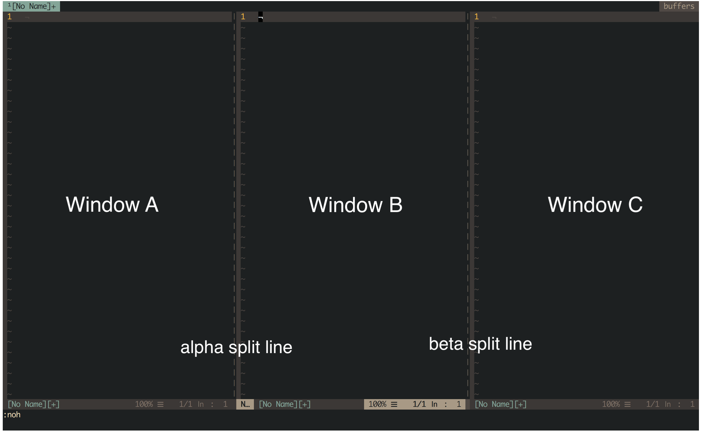

# VimResizeMe
Resize window with ease.
## Usage


| Window/Action | :VrmResizeRight  | :VrmResizeLeft  |
|---------------|------------------|-----------------|
| A             | move alpha right | move alpha left |
| B             | move beta  right | move alpha left |
| C             | move beta  right | move beta  left |


| Window/Action | :VrmResizeUp  | :VrmResizeDown  |
|---------------|---------------|-----------------|
| D             | move gamma up | move gamma down |
| E             | move gamma up | move delta down |
| F             | move delta up | move delta down |

See the `:help vimresizeme` for details.
## Installation
For vim-plug:
```
Plug 'amikai/VimResizeMe'
```
For dein.vim:
```
call dein#add('amikai/VimResizeMe')
```
For Vundle.vim:
```
Plugin 'amikai/VimResizeMe'
```
## Key mapping
In macOS:
- `<fn>` + `<Up>` = `<PageUp>`
- `<fn>` + `<Down>` = `<PageDown>`
- `<fn>` + `<Right>` = `<Home>`
- `<fn>` + `<Left>` =` <End>`

So I suggest following mapping:
```
nnoremap <PageUp> :VrmResizeUp<CR>
nnoremap <PageDown> :VrmResizeDown<CR>
nnoremap <Home> :VrmResizeRight<CR>
nnoremap <End> :VrmResizeLeft<CR>
```
Others:
```
nnoremap <C-Up> :VrmResizeUp<CR>
nnoremap <C-Down>:VrmResizeDown<CR>
nnoremap <C-Right> :VrmResizeRight<CR>
nnoremap <C-Left> :VrmResizeLeft<CR>
```
